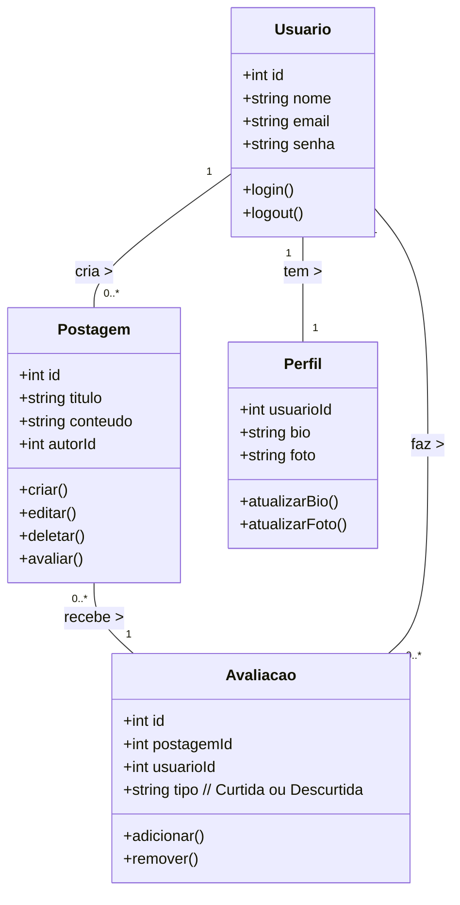
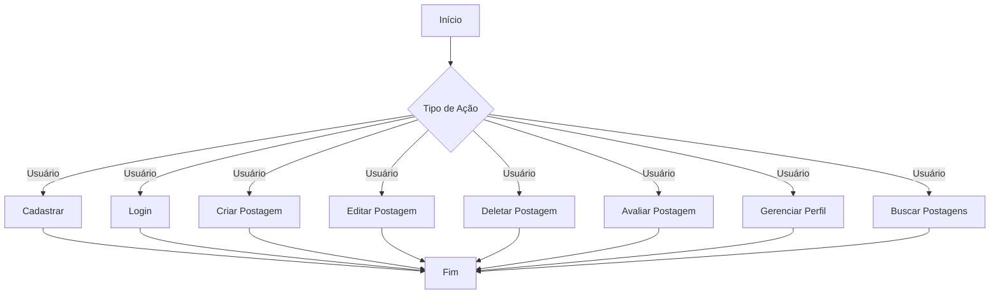
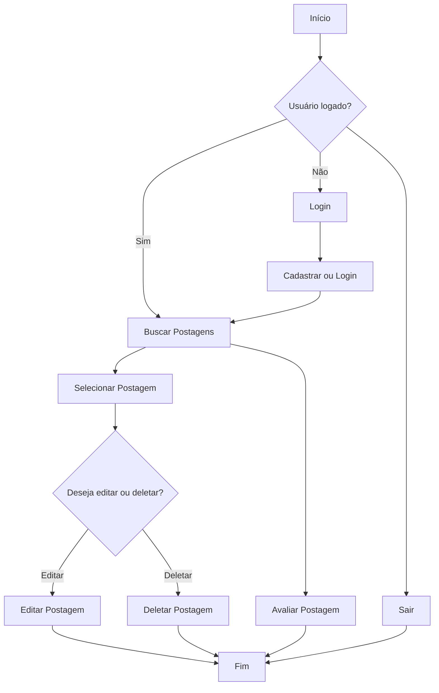
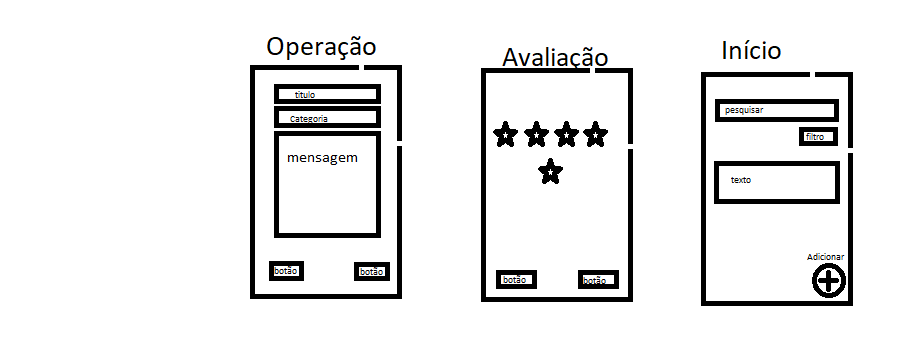
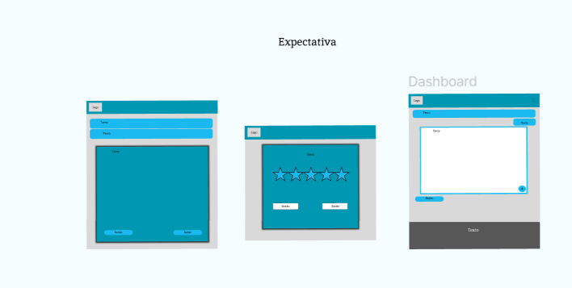
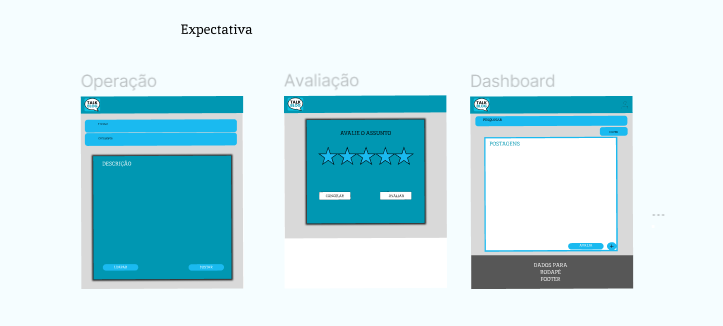
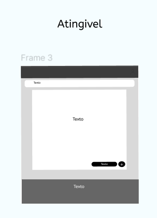
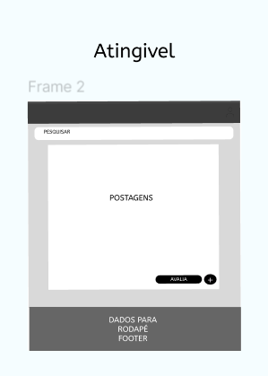

# Talk Blog

## Sobre o Projeto

Bem-vindo ao Talk Blog – o espaço onde a conversa se transforma em conexão. Somos apaixonados por criar um ambiente vibrante e inclusivo onde ideias podem florescer e discussões se aprofundar. No Talk Blog, acreditamos que a comunicação é a chave para o entendimento e a evolução.

Nosso objetivo é criar um ponto de encontro digital para curiosos, pensadores e apaixonados por debates construtivos. Queremos ser mais do que apenas um blog; queremos ser uma comunidade onde cada voz tem espaço e cada perspectiva é valorizada.

## Objetivo do Projeto

**Objetivo:** Desenvolvimento e Lançamento da Plataforma

- **Específico:** Criar uma plataforma de blog interativa e responsiva onde os usuários possam se cadastrar, criar e editar postagens, avaliar postagens (curtidas e descurtidas) e gerenciar seus perfis.
- **Mensurável:** A plataforma deve incluir pelo menos 5 páginas principais (home, perfil, postagens, busca e configurações) e ter todas as funcionalidades operacionais.
- **Atingível:** Com uma equipe técnica qualificada e uso de tecnologias adequadas, o desenvolvimento pode ser realizado dentro do prazo estabelecido.
- **Relevante:** Este objetivo é essencial para fornecer uma base sólida e funcional para o blog, permitindo que todas as outras funcionalidades sejam implementadas e utilizadas.
- **Temporal:** Concluir o desenvolvimento e lançar a plataforma em 3 meses, com a primeira versão pronta para testes em 8 semanas e o lançamento final 1 semana após a conclusão dos testes.

## Funcionalidades

- Cadastro e Login de Usuários
- Criação e Edição de Postagens
- Sistema de Avaliação
- Gerenciamento de Perfil
- Busca e Navegação

## Cronograma

- **Fase de Planejamento (2 semanas)**
  - Definição de requisitos
  - Planejamento do projeto

- **Fase de Design (3 semanas)**
  - Criação de wireframes e protótipos
  - Revisão e aprovação do design

- **Fase de Desenvolvimento (8 semanas)**
  - Implementação do backend e frontend
  - Desenvolvimento de funcionalidades principais

- **Fase de Testes (2 semanas)**
  - Testes funcionais e de usabilidade
  - Correção de bugs

- **Fase de Lançamento (1 semana)**
  - Preparação para o lançamento
  - Lançamento final da plataforma

## Análise de Risco

- **Risco: Atrasos no Desenvolvimento**
  - **Probabilidade:** Média
  - **Impacto:** Alto
  - **Mitigação:** Estabelecer marcos claros e revisões semanais do progresso.

- **Risco: Problemas Técnicos e Bugs**
  - **Probabilidade:** Média
  - **Impacto:** Médio
  - **Mitigação:** Realizar testes extensivos e ter uma equipe de suporte pronta para resolver problemas rapidamente.

- **Risco: Falta de Recursos**
  - **Probabilidade:** Baixa
  - **Impacto:** Médio
  - **Mitigação:** Garantir uma alocação adequada de recursos e ter um plano de contingência.

- **Risco: Feedback Negativo Inicial**
  - **Probabilidade:** Média
  - **Impacto:** Médio
  - **Mitigação:** Implementar um sistema de feedback e ajustes contínuos baseado nas sugestões dos usuários.

## Recursos

- **Equipe de Desenvolvimento**
  - Desenvolvedores frontend e backend
  - Designer de UI/UX
  - Especialista em segurança

- **Tecnologias e Ferramentas**
  - **Backend:** Python/Django ou Node.js
  - **Frontend:** React.js ou Angular
  - **Banco de Dados:** MySQL, PostgreSQL ou MongoDB
  - **Infraestrutura:** Servidores para hospedagem (AWS, Google Cloud, etc.)

- **Recursos Adicionais**
  - **Marketing e Divulgação:** Orçamento para campanhas de marketing digital
  - **Ferramentas de Gestão:** Software de gerenciamento de projetos (Microsoft Project, Trello)

## Identidade Visual

- **Nome da Marca:** TALK BLOG
- **Slogan:** “Discussões Que Valem a Pena”
- **Fontes:** Poppins – Google Fonts (https://fonts.google.com/specimen/Poppins)

### Diagramas

1. Classe

  2. Uso

  3. Fluxo

### Protótipo(Expectativa)
1. Baixa(Expectativa):

2. Média(Expectativa):

3. Alta(Expectativa):

### Protótipo(Atingível)

1. Baixa(Atingível):

2. Média(Atingível):

3. Alta(Atingível):

